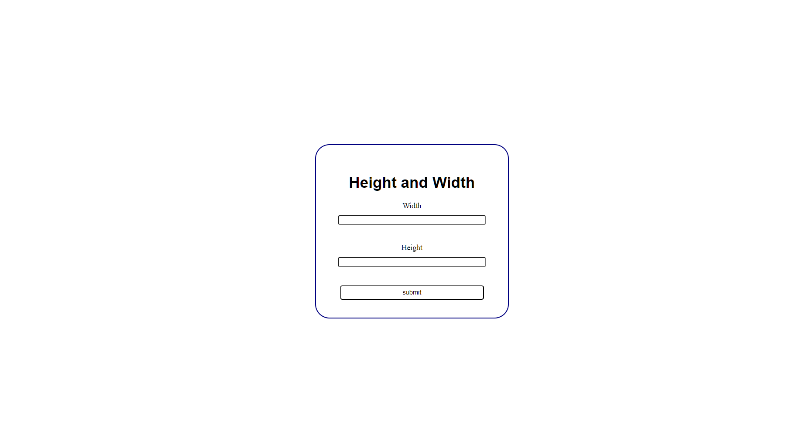
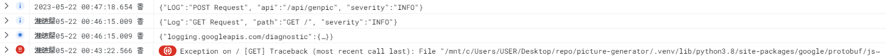
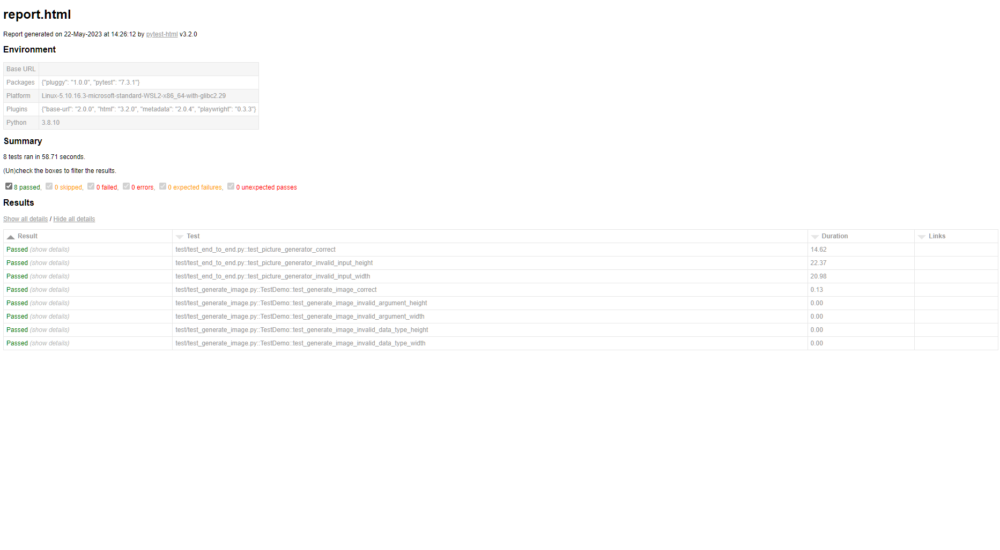
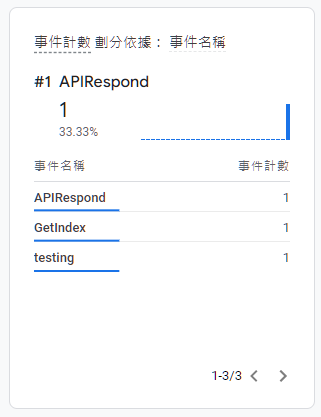

# Qsearch Backend Test
- [Qsearch Backend Test](#qsearch-backend-test)
  - [Arithmetic Operation](#arithmetic-operation)
    - [Usage](#usage)
    - [Testcase](#testcase)
    - [Complexity](#complexity)
  - [Flask API Server](#flask-api-server)
    - [API](#api)
    - [Google Cloud Logging](#google-cloud-logging)
    - [Testing](#testing)
        - [Unit Test](#unit-test)
        - [e2e test](#e2e-test)
        - [Testing Report](#testing-report)
    - [Google Analytics Event](#google-analytics-event)
  - [Database Comparison](#database-comparison)
  - [Road Map](#road-map)


## Arithmetic Operation

Language: Python

### Usage
1. git clone the project
2. ```python calculation.py```
3. enter arithmetic expression and get the answer

### Testcase

The following cases have been tested and get correct answers.

case 1: addition and substraction only
| expression   |    result |
|--------------|-----------|
|3+5           |          8|
|2-3+5         |          4|
|2-5-8         |        -11|
|1-2-3-4-5     |        -13|

case 2: addition, substraction and parenthesis
| expression        |    result |
|-------------------|-----------|
|2+(3+5)            |         10|
|2+(3-5)            |          0|
|3-(10-2)           |         -5|
|1-(9+4)            |        -12|
|1-(1-(1-(1-2)))    |          2|
|1-(3+(2-(2+(2-5))))|         -5|

case 3: multiplication and division
| expression        |    result |
|-------------------|-----------|
|2*3                |          6|
|6/3                |          2|
|2*4*5              |         40|
|4/2/2              |          1|
|2*8/4              |          4|
|16/4*3             |         12|
|1024/4/4/4/4       |          4|

case 4: multiplication, division and parenthesis
| expression                     |    result |
|--------------------------------|-----------|
|4*(2*2)                         |         16|
|2*(4/2)                         |          4|
|16/(4/2)                        |          8|
|12/(2*3)                        |          2|
|1024/(256/(128/(64/(16/(2*2)))))|         32|

case 5: addition, substraction, multiplication and division
| expression                     |    result |
|--------------------------------|-----------|
|1+1*2*3+1                       |          8|
|2-1*3*2-8                       |        -12|
|3-16/2*2+16                     |          3|
|18/2/3+2-1                      |          4|

case 6: addition, substraction, multiplication, division and parenthesis
| expression                     |    result |
|--------------------------------|-----------|
|1+(2*2+3)+2                     |         10|
|1-(2*2-3)-2                     |         -2|
|1-2*(1-2*3)                     |         11|
|16/4*(3/3*2-4*2)                |        -24|

testcase 7: complex cases
| expression                                    |    result |
|-----------------------------------------------|-----------|
|((2+(3-1)*5)-(4-1))*(3+2)                      |         45|
|(((2+3)*4-5)-2)*((1-2)*3)                      |        -39|
|((8-3)*(5+2)/(2-1))/(3+2-1)                    |       8.75|
|((1+2)*(3+4)-5)*((6-7)*(8-9))                  |         16|
|((8/2*(3+1))-((5+2)/(3-2)))*(4-3)              |          9|
|((5-2)/(1+3)*(4-2))-((6-3)*(9+1))              |      -28.5|
|((10/2+3-2)*(7-3))/(6+4)                       |        2.4|
|(5/2*(4-1))+(3-1)/(6-4)                        |        8.5|
|((2+3)*(8-4)/(6-1))-((7-6)/(9-8))              |        3.0|
|((7+3*(8-4)/2)*2-(5*2)+(4-1))/(((9-3)*(2+1))+1)|          1|

### Complexity
Data Structure: stack
Time complexity: O(N)
Space Complexity: O(N)


## Flask API Server

**Project Structure**
```
picture-generator/
├── README.md
├── app.py
├── calculation.py
├── config.py
├── image
│   ├── event.png
│   ├── image.png
│   ├── log.png
│   ├── menu.png
│   └── report.png
├── model.py
├── requirements.txt
├── static
│   ├── error
│   │   └── index.css
│   └── picture
│       └── index.css
├── templates
│   ├── error
│   │   └── index.html
│   └── picture
│       └── index.html
├── test
│   ├── test_end_to_end.py
│   └── test_generate_image.py
└── utils
    ├── event.py
    └── logging.py
```

### API

```
GET /
Retrieves menu HTML file
```
**Request**
+ Method: `GET`

**Response**
+ Status: `200 OK`
+ Content-Type: `text/html`

**Demo**


---

```
POST /
Submit form data and get image back
```
**Request**
+ Method: `POST`
+ Parameters
  + width: (required, integer)
  + height: (required, integer)

**Response**
+ Status: `200 OK`
+ Content-Type: `image/png`

**Demo**
Image Size: `240 X 360`


### Google Cloud Logging
There are three types of logging for monitoring

`start_log`
+ Time:the begining of the service
+ Structure

```
{
  'Log': 'service started',
  'severity': 'INFO',
}
```
---
`get_request_log`
+ Time: the server recieve GET request
+ Structure

```
{
  'Log': 'GET Request',
  'path': 'GET ' + URL,
  'severity': 'INFO',
}
```

Usage: `GET /`
```
{
  'Log': 'GET Request',
  'path': 'GET /',
  'severity': 'INFO',
}
```

---
`post_request_log`
+ Time: the server receive POST request
+ Structure

```
{
  'LOG': 'POST Request',
  'api': api,
  'severity': 'INFO',
}
```
Usage: `POST /`
```
{
  'LOG': 'POST Request',
  'api': '/api/genpic',
  'severity': 'INFO',
}
```
---
**Demo**
Screenshot from GCP Logging Explorer



### Testing

##### Unit Test

Package: `pytest`

Path: `test/test_generate_image.py`

Target: test function `generate_image` in `model.py`

Total Cases: 5

**Testcase 1**

| parameter | type | value |
|-----------|------|-------|
| height    | int  | 100   |
| width     | int  | 200   |

**Testcase 2**

| parameter | type | value |
|-----------|------|-------|
| height    | int  | -1    |
| width     | int  | 100   |

**Testcase 3**

| parameter | type | value |
|-----------|------|-------|
| height    | int  | 100   |
| width     | int  | -1    |

**Testcase 4**

| parameter | type | value |
|-----------|------|-------|
| height    | str  | '100' |
| width     | int  | 100   |

**Testcase 4**

| parameter | type | value |
|-----------|------|-------|
| height    | int  | 100   |
| width     | str  | '200' |

---

##### e2e test

Package: `playwright`

Path: `/test/test_end_to_end.py`

Total Case: 3

**Testcase 1**

| parameter | type | value |
|-----------|------|-------|
| height    | str  | '100' |
| width     | str  | '200' |

Result: get image with 100px height and 200px width

**Testcase 2**

| parameter | type | value |
|-----------|------|-------|
| height    | str  | '400' |
| width     | str  | ''    |

Result: get error page

**Testcase 2**

| parameter | type | value |
|-----------|------|-------|
| height    | str  | ''    |
| width     | str  | '600' |

Result: get error page

---

##### Testing Report



### Google Analytics Event

There are two events.

`GET /`

send event `GetIndex` to google analytics


`POST /`

send event `APIRespond` to google analytics

**Demo**



## Database Comparison

+ Database Model:
   - RDB：Use table structure for storaging, in the form of row and column.
   - NoSQL：NoSQL use Document, Time Series, Column ,Key-Value structures for storage.
+ Elasticity:
   - RDB：RDB requres stricter schema and the schema needs to be designe carefully before implementation. It is useful for handling structural data.
   - NoSQL: Elastic schema for NoSQL Database, schema can be changed dynamically. No predesign schema is needed.
+ Scenario:
  - RDB: Good performance for application that requires consistent data format, such as banking system and e-commerce or CMS system.
  - NoSQL: Useful for inconsistent data format such as social media and logging analysis, etc.
+ Performance
  - RDB: Outperform NoSQL in complex query and multiple table relationship, support high consistency.
  - NoSQL: Support high read/write operations.

## Road Map

+ Internet related domain knowledge: DNS, Domain Name, HTTP/HTTPS
+ Programming Language (LeetCode 256 problem solved) 
  + C/C++
  + JavaScript
  + Python
+ Version Control
  + Git/GitHub
  + Git flow
+ Database
  + Relational Database: MySQL
  + NoSQL: MongoDB
  + Others: ORM, SQL Syntax, Transaction, Normalization
+ API: 
  + REST API 
  + GraphQL
  + Third party APIs connection
+ Authentication: JWT
+ CI/CD: Git Action
+ Containerization:
  + Docker
  + Docker-compose
  + Kubernetes (basic): deployment, service, ingress
+ Web Server
  + Nginx: reverse-proxy, load-balancing